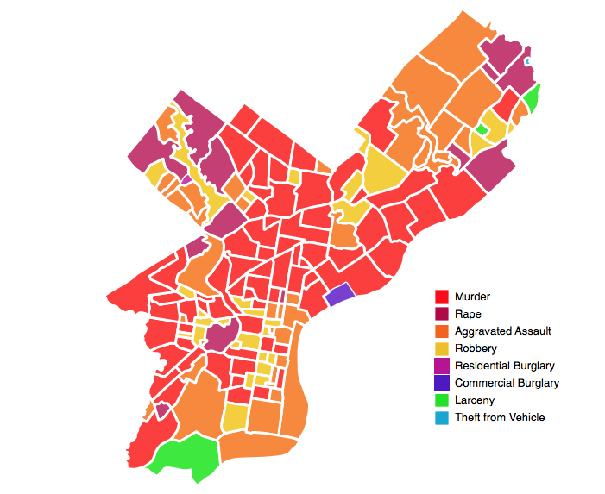

# Cost of Crime Calculator
_An R script that calculates the total cost of crime for neighborhoods using the RAND Corporation's cost of crime values_

See the output in a web map [here](https://chipkoziara.github.io/crime_costs/) built using <a href="https://www.mapbox.com/mapbox-gl-js/api/">Mapbox GL JS</a> and <a href="https://www.mapbox.com/mapbox-studio/">Mapbox Studio</a>! You can see the code in the <em><a href="https://github.com/chipkoziara/crime_costs/blob/master/index.html">index.html</a></em> file in this repo.

 _This shows the crime type with the greatest cost for each neighborhood in 2015_

**What does this R script do?**
This R script counts the number of crimes in each Philadelphia neighborhood and calculates the cost of each type of crime. Values for the total cost of all crimes per neighborhood, as well as which crime type has the highest cost per neighborhood, are also calculated.

The script outputs two shapefiles, one for neighborhoods and the other for Census block groups.

I've included a QGIS project file with styling (shown above) that highlights the crime type that represents the greatest cost for that polygon.

**How can I run this myself?**
These instructions assume you have R installed:

1. Clone the repo
2. Run the script from the script's directory with `Rscript cost_of_crime.R`
3. Check the `output` directory for the shapefiles created from the script

Related notes:
>_The script requires the `input` directory_

>_The `output` directory is included for reference_

>_This script is configured to overwrite the contents of `output`_

**What are next steps?**
I plan to make it easier to plug in a new city's open crime data and neighborhood shapefile to make this portable to other municipalities.

~~I also plan to introduce a web-based map that makes it easy to explore this data in the browser.~~ Done! Check it out <a href="https://chipkoziara.github.io/crime_costs/">here</a> or dig into the code in this repo <em><a href="https://github.com/chipkoziara/crime_costs/blob/master/index.html">index.html</a></em>.

**Special Thanks**
I'm using the the City of Philadelphia's [open crime data](https://www.opendataphilly.org/dataset/crime-incidents), the RAND Corporation's [cost of crime calculator](http://www.rand.org/jie/justice-policy/centers/quality-policing/cost-of-crime.html) values, and Azavea's excellent [Philadelphia neighborhoods](https://github.com/azavea/geo-data/tree/master/Neighborhoods_Philadelphia) shapefile.

